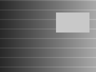
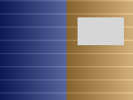
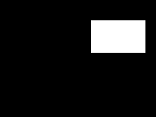

# Small, redistributable examples

These three synthetic images illustrate grayscale input, an interpreted chroma
field and a neutral scientific inset. They are original algorithmic fixtures,
not screenshots, model predictions, or evidence of Feynman restoration quality.

| Grayscale fixture | Chroma illustration | Protected neutral inset |
| --- | --- | --- |
|  |  |  |

Regenerate with `python scripts/make_synthetic_examples.py`. They are MIT licensed
with the project. Real source clips, generated references and contact sheets are
deliberately absent pending their respective publication permissions.

See `reviewed-shots.json` for the half-open census shape. Its 1,440-frame timeline
is synthetic and must match an actual source before being used with `init`.
